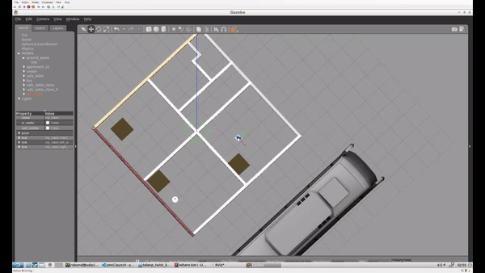

# udacity_robot_software_engineer_nd
Nanodegree for robot software engineer on Udacity

Please note that the current project to submit is always located in the root folder. It should be straight forward to use the repo root as catkin workspace. Previous project material should be found as hidden folder with the scheme ".prjectX/", with X indicating the project number. 
Small change for test push

# Project 3: Where Am I

The goal of this is the localization of a mobile robot using the ROS AMCL package.
The generated PGM Map should align in RVIZ with the robot and what it detects with its sensors.

## Demo 
In following GIF you can see how we kidnap the robot and it has to relocate itself on the map:


## Differences to the project requirements

Please note, that since in world.launch the robot is specified to be instantiated at point (2.0, -1.5), I also specified in the amcl.launch file the initial pose to be (2.0, -1.5). This change has to be made, since my worlds origin, (0.0, 0.0), is within the walls.

## Prerequisites

The project consists of the following parts:
- ROS packages: [map_server](http://wiki.ros.org/map_server), [amcl](http://wiki.ros.org/amcl), 
[move_base](http://wiki.ros.org/move_base).
- The PGM Map file used for the localization was created with following tool: 
[pgm_map_creator](https://github.com/hyfan1116/pgm_map_creator)

for installing the ros packages use these instructions
```
$ sudo apt-get update && sudo apt-get upgrade -y
$ sudo apt-get install ros-${ROS_DISTRO}-map-server
$ sudo apt-get install ros-${ROS_DISTRO}-amcl
$ sudo apt-get install ros-${ROS_DISTRO}-move-base
```

## Build and Launch
1. Clone project and initialize catkin workspace
```
$ git clone https://github.com/farkas93/udacity_robot_software_engineer_nd catkin_ws
$ cd catkin_ws/src
$ catkin_init_workspace
```

2. Also within `catkin_ws/src`, clone the `teleop` package
```
$ git clone https://github.com/ros-teleop/teleop_twist_keyboard
```

3. Move back to `catkin_ws\` and build
```
$ cd ..
$ catkin_make
```

4. Launch the world and the robot
```
$ source devel/setup.bash
$ roslaunch my_robot world.launch
```

5. Open another terminal, and execute the package with the `amcl.launch` file. Here,
the map_server, amcl, and move_back packages will be launched.
```
$ source devel/setup.bash
$ roslaunch my_robot amcl.launch
```

6. Open another terminal, and run the `teleop` node.
```
$ source devel/setup.bash
$ rosrun teleop_twist_keyboard teleop_twist_keyboard.py
```

7. Navigate the robot around and let it locate itself.

