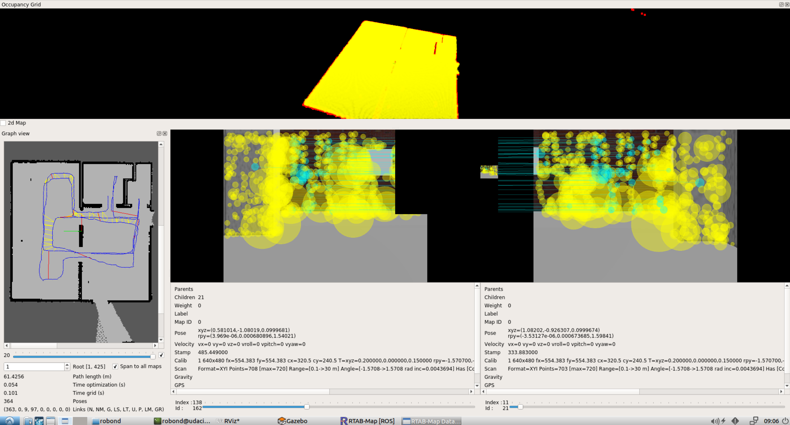
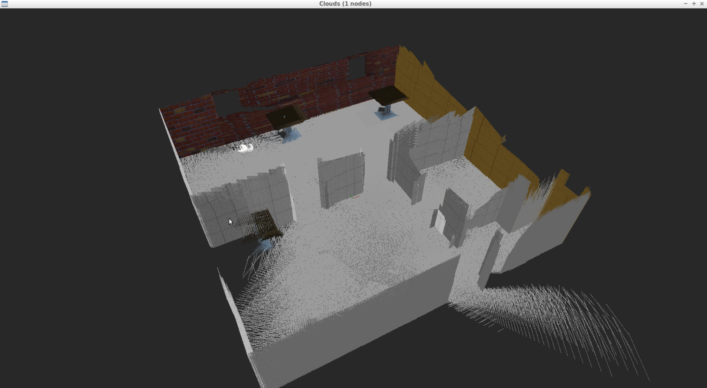
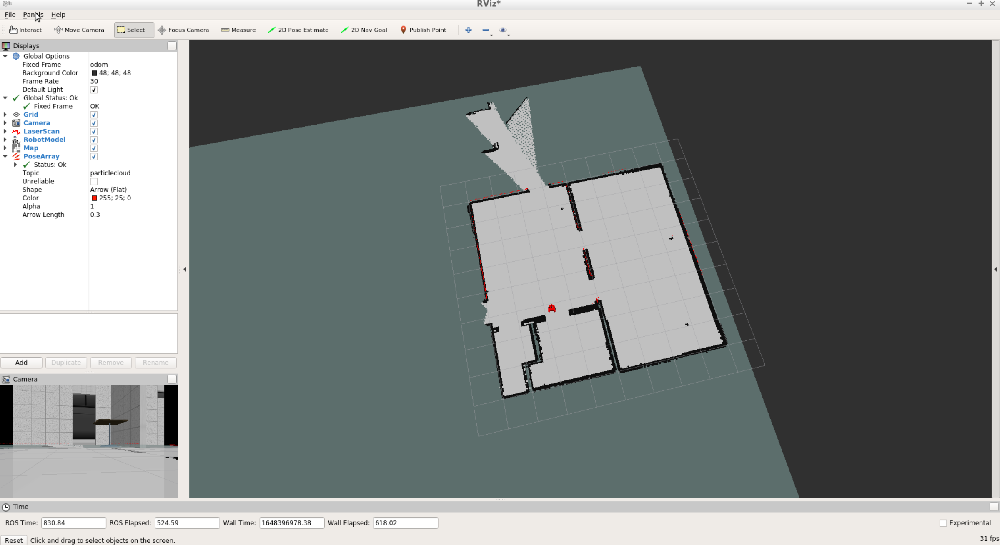

# udacity_robot_software_engineer_nd
Nanodegree for robot software engineer on Udacity

Please note that the current project to submit is always located in the root folder. It should be straight forward to use the repo root as catkin workspace. Previous project material should be found as hidden folder with the scheme ".prjectX/", with X indicating the project number. 
Small change for test push

# Project 4: Map My World

The goal of this is creating a map with the RTAB-SLAM algorithm.

## Demo 

Following screenshots show my slam run with rtabmap package:







## Prerequisites

The project consists of the following parts:
- ROS packages: [rtabmap](http://wiki.ros.org/rtabmap_ros/)

for installing the ros packages use these instructions
```
$ sudo apt-get update && sudo apt-get upgrade -y
$ sudo apt-get install ros-${ROS_DISTRO}-rtabmap-ros
```

## Build and Launch
1. Clone project and initialize catkin workspace
```
$ git clone https://github.com/farkas93/udacity_robot_software_engineer_nd catkin_ws
$ cd catkin_ws/src
$ catkin_init_workspace
```

2. Also within `catkin_ws/src`, clone the `teleop` package
```
$ git clone https://github.com/ros-teleop/teleop_twist_keyboard
```

3. Move back to `catkin_ws\` and build
```
$ cd ..
$ catkin_make
```

4. Launch the world and the robot
```
$ source devel/setup.bash
$ roslaunch my_robot world.launch
```

5. Open another terminal, and execute the package with the `mapping.launch` file. Here,
the RTAB-mapping algorithm will be launched for doing the SLAM.
```
$ source devel/setup.bash
$ roslaunch my_robot mapping.launch
```

6. Open another terminal, and run the `teleop` node.
```
$ source devel/setup.bash
$ rosrun teleop_twist_keyboard teleop_twist_keyboard.py
```

7. Navigate the robot around and let it perform the SLAM .

8. Open another terminal, and execute the package with the `localization.launch` file. Here,
the RTAB-mapping algorithm will be launched in localization mode, using the database generated previously.
```
$ source devel/setup.bash
$ roslaunch my_robot localization.launch
```
